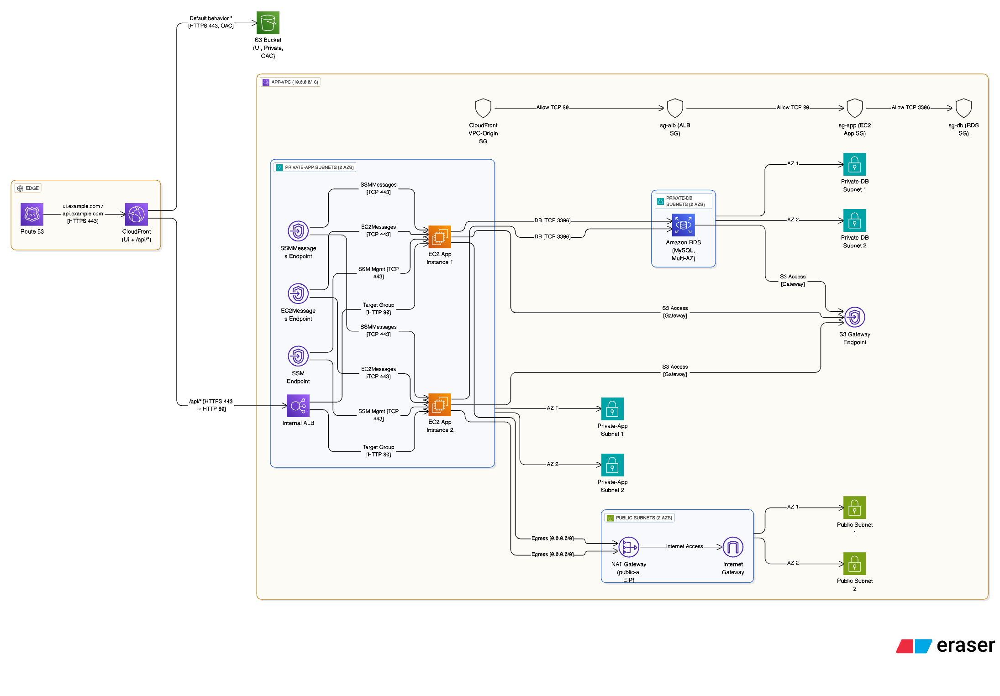

# 

#  AWS Infrastructure (CloudFront + Internal ALB + EC2 + RDS + Private Networking)

### 🏗️ Edge and DNS

- **Route 53** hosts records:
    - `ui.example.com`  → CloudFront Distribution (UI)
    - `/api/*`  routes handled by same CloudFront distribution using a VPC Origin

- **CloudFront Distribution** (HTTPS 443):
    - **Origin 1:** S3 (OAC) for static UI files. Default behavior `*`  → S3.
    - **Origin 2:** VPC Origin for `/api/*`  routed to internal ALB over HTTP:80.
    - Viewer protocol policy: Redirect HTTP → HTTPS.
    - Cache policy: CachingDisabled for `/api/*` .

---

### 🗂️ S3 (UI)
- Private bucket hosting static UI (index.html, JS, CSS).
- Access controlled via **OAC**.
- Public access block enabled.
---

### 🌐 VPC and Networking
- **VPC:** `10.0.0.0/16` 
#### Subnets
- **Public Subnets** (AZ-a, AZ-b)
    - CIDRs: 10.0.0.0/24, 10.0.1.0/24
    - Contain: Internet Gateway, NAT Gateway

- **Private-App Subnets** (AZ-a, AZ-b)
    - CIDRs: 10.0.10.0/24, 10.0.11.0/24
    - Contain: Internal ALB, EC2 App instances

- **Private-DB Subnets** (AZ-a, AZ-b)
    - CIDRs: 10.0.20.0/24, 10.0.21.0/24
    - Contain: RDS database

#### Gateways and Routes
- **Internet Gateway (IGW)** attached to VPC.
- **NAT Gateway** in `public-a`  with Elastic IP.
- **Route Tables:**
    - Public → IGW
    - Private-App → NAT
    - Private-DB → Local only

---

### 🔗 VPC Endpoints
- **Interface Endpoints** (in private-app subnets):
    - `ssm` , `ssmmessages` , `ec2messages` 
    - Allow TCP 443 from EC2 SG

- **Gateway Endpoint:** S3 for private traffic to S3 (used by EC2 for artifacts)
---

### ⚙️ Application Layer
- **Internal ALB**
    - Scheme: Internal
    - Listener: HTTP :80 → Target Group (EC2)
    - Health check: `/health` 

- **EC2 Application Instances** (x2)
    - Private-only
    - Run Java Spring Boot app exposing `/api/customers` , `/api/health` , `/health` 
    - Listen on port 80 (bind 0.0.0.0)
    - IAM Role: AmazonSSMManagedInstanceCore

---

### 🗄️ Database
- **Amazon RDS (MySQL)**
    - Private-DB subnets (Multi-AZ optional)
    - Port 3306
    - No public access

---

### 🔐 Security Groups
| Source | Destination | Port | Purpose |
| ----- | ----- | ----- | ----- |
| CloudFront VPC-Origin SG | ALB SG | 80 | CloudFront → ALB |
| ALB SG | EC2 SG | 80 | ALB → EC2 App |
| EC2 SG | RDS SG | 3306 | App → Database |
| EC2 SG | Interface Endpoints | 443 | SSM connectivity |
---

### 🧭 Traffic Flow
1. User → CloudFront (HTTPS 443)
2. CloudFront `/`  → S3 OAC → UI HTML/CSS/JS
3. CloudFront `/api/*`  → VPC Origin → Internal ALB (HTTP 80)
4. ALB → EC2 (HTTP 80)
5. EC2 → RDS (MySQL 3306)
6. EC2 → SSM (443, via endpoints)
7. EC2 → Internet (via NAT for updates)
---

### 🧱 Grouping (for Eraser boxes)
- **Edge:** Route 53, CloudFront (UI + API behaviors)
- **Public Subnets:** IGW, NAT Gateway
- **Private-App Subnets:** Internal ALB, EC2 instances, Interface endpoints
- **Private-DB Subnets:** RDS instance(s)
- **VPC Endpoints:** SSM, EC2Messages, SSMMessages, S3
---

### 🪶 Notes
- No component has public IP except NAT Gateway.
- CloudFront handles all HTTPS, backend stays HTTP (port 80).
- S3 is private (OAC only).
- ALB is internal (not internet-facing).
- EC2 communicates with SSM via VPC endpoints.
- CloudFront connects to ALB via VPC Origin (ENIs inside VPC).
Render all components with AWS service icons and draw directional arrows labeled with ports:

- HTTPS 443 (CloudFront)
- HTTP 80 (ALB ↔ EC2)
- MySQL 3306 (EC2 ↔ RDS)
- HTTPS 443 (SSM endpoints)

